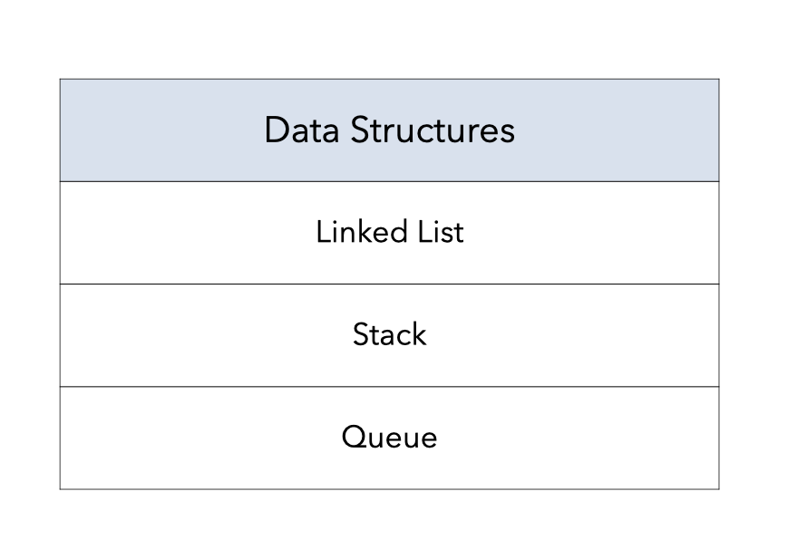

# Data Structures
Library of data structures implemented in C. Current data structrures:

<p align="center">
    
</p>

## Installation

Run the following command to compile the code:

```bash
make
```


## Usage

To test the different data structures, change the code in `src/main.c` and run it as:

```bash
./main
```

